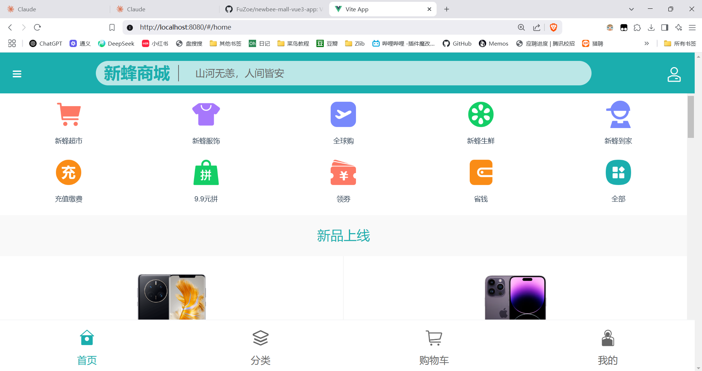
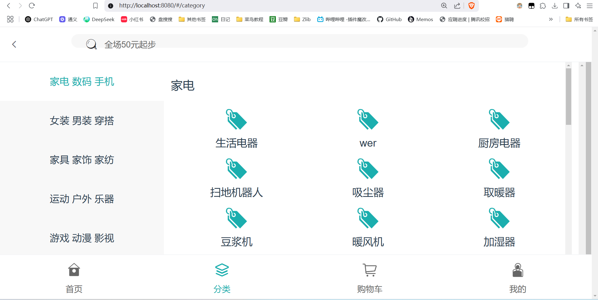
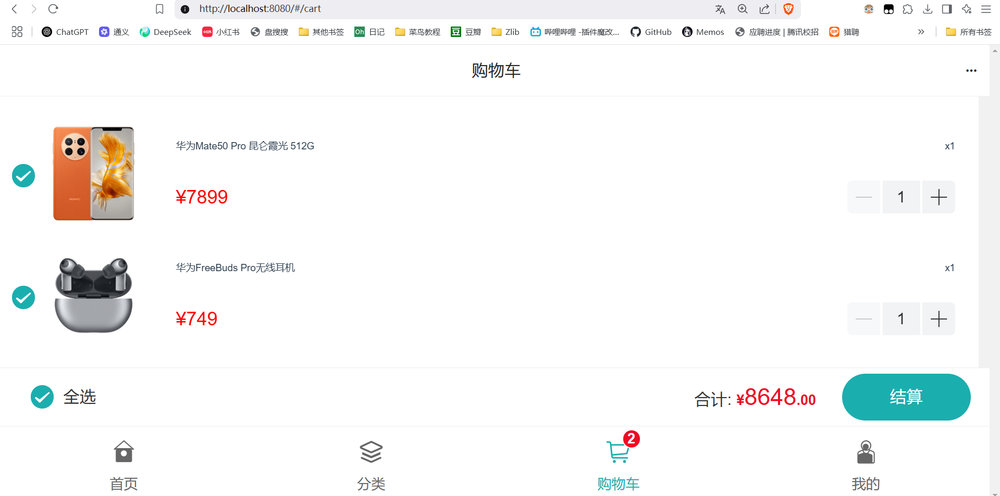

newbee-mall 项目是一套电商系统，包括 newbee-mall 商城系统及 newbee-mall-admin 商城后台管理系统，基于 Spring Boot 和 Vue 以及相关技术栈开发。 前台商城系统包含首页门户、商品分类、新品上线、首页轮播、商品推荐、商品搜索、商品展示、购物车、订单结算、订单流程、个人订单管理、会员中心、帮助中心等模块。 后台管理系统包含数据面板、轮播图管理、商品管理、订单管理、会员管理、分类管理、设置等模块。

首先，在 https://nodejs.org/zh-cn 官网下载Node.js来运行JavaScript

然后，在项目根目录打开终端，执行以下命令

  npm install
  
  npm install -g @vue/cli
  
  npm install vite --save-dev

然后，直接在根目录下，运行命令

  npx vite
  
最后用浏览器打开网站
http://localhost:8080/#/home

运行成功示例图如下：

终端界面如下：

